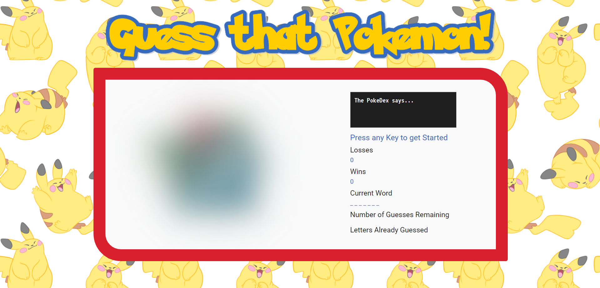

# Word Game - Guess that Pokemon!
A word guess or Hangman style game, based on guessing the names of the original 151 pokemon.

## Author
Madeleine Griggs, original design by the UofT coding bootcamp.

## About this Project
this is a hangman style game, where you guess the letters of the name of a randomly selected pokemon. It was developed as part of the UofT coding bootcamp. It is written in plain Javascript, HTML, and CSS.

## Information about the Theme

### Colors Used
-  `#D9202E - PokeRed: used for the border of the game container.`
-  `#386abb - PokeBlue: used for some of the text, also appears in the title image.`
-  `#1e1e1e - Charcoal: used for the pokeDex area, and some of the text.`
-  `#f9f9f9 - offWhite: used for the background of the game container, pokeDex text.`

### Fonts Used
- Font Family: 'VT323', monospace. Used for PokeDex text.
- Font Family: 'Roboto', sans-serif. Used for game container text.
- Note: The title 'Guess That Pokemon!' is an image, since I could not find a web font that looked similar to the pokemon logo. You can find the font generator I used to creat the image here: [Pokemon Font Generator](https://fontmeme.com/pokemon-font/)

### Images Used
- I found the images for the pokemon off the site Bulbapedia, a fan made wikipedia style site, found here: [Bulbapedia](https://bulbapedia.bulbagarden.net/wiki/Main_Page);
- The fun tileable pikachu background comes from this artist: [Link to Artist's Tumblr](https://tipsycanadian.tumblr.com/post/164733637684/fat-pikachus-are-best-pikachus-cleaned-and)

### Screenshots

